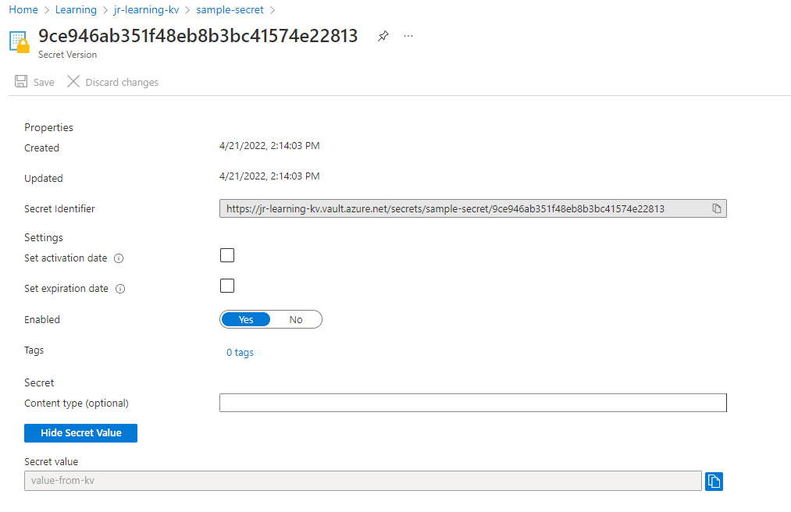
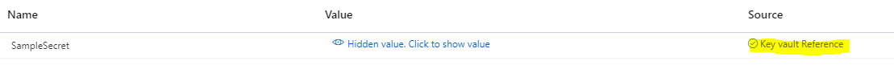

# Provision example by using AZ commands

1\.  Enable Managed Identity to WebApp

```
az webapp identity assign --resource-group <resource-group> --name <webapp>
```

2\. Obtain Web App Managed Identity Id   

```
az webapp identity show --name <webapp> --resource-group <resource-group> --query principalId --output tsv
```

3\. Create an association with the Web App Managed Identity Id and a Key Vault policy

```
az keyvault set-policy --name <keyvault> --secret-permissions get --object-id <object-id>
```

4\. Set a new Application setting by referencing the secret URI

```
az webapp config appsettings set --name <webapp> --resource-group <resource-group> --settings KEY_FROM_VAULT=”@Microsoft.KeyVault(SecretUri=<secret-uri>")
```

For example:



```
az webapp config appsettings set --name <webapp> --resource-group <resource-group> --settings SampleSecret=”@Microsoft.KeyVault(SecretUri=https://jr-learning-kv.vault.azure.net/secrets/sample-secret/9ce946ab351f48eb8b3bc41574e22813")
```

5\. The result Application Settings should look like this:


